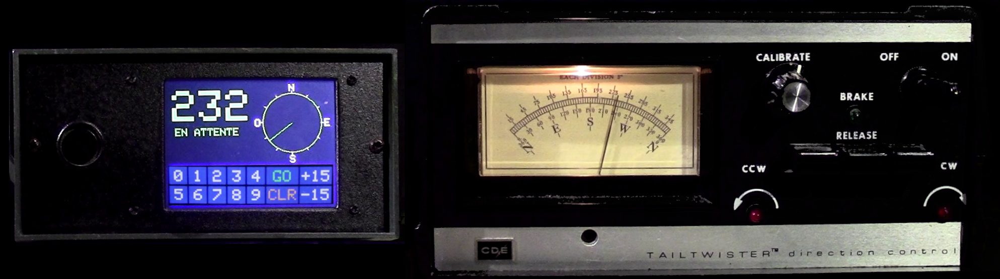

# HyGain_Rotator_Control_Box
Let's improve an existing HyGain rotator analog control box by adding a modern color touch-screen controller.

By Bertrand Zauhar, VE2ZAZ / VA2IW   
https://ve2zaz.net   
https://github.com/VE2ZAZ   
https://www.qrz.com/db/VE2ZAZ   

Like most HyGain antenna rotator models, the TailTwister is a rugged and dependable unit. Mine dates 1980 and, thanks to regular maintenance every 10 years, is still going strong. However, the control box has an outdated interface, with analog heading indication and manual orientation and brake release levers. We are far form a "set heading and forget" approach here! Looking around, it is possible to purchase readily made electronic controllers, but their prices (ranging from a few to several hundred dollars) are unreasonable to me. I would rather have fun designing and building a controller that meets all my requirements, and at a fraction of the asked price for a commercial unit.

This project details the design and construction of an add-on unit to existing CD-45, CD45-II, Ham-III, Ham-IV and TailTwister rotator control boxes, It brings several desirable features, such as a color touch-screen, a rotary encoder and remote control via a computer. This makes it a real automated unit! No more manual controls...unless you still want to!

This is the firmware repository for the project. For more details on the project implementation (features, hardware, operation, etc.), please visit [the author's website](https://ve2zaz.net/T2X_Rotator_Cntrl/Modern_T2X_Control.htm).
